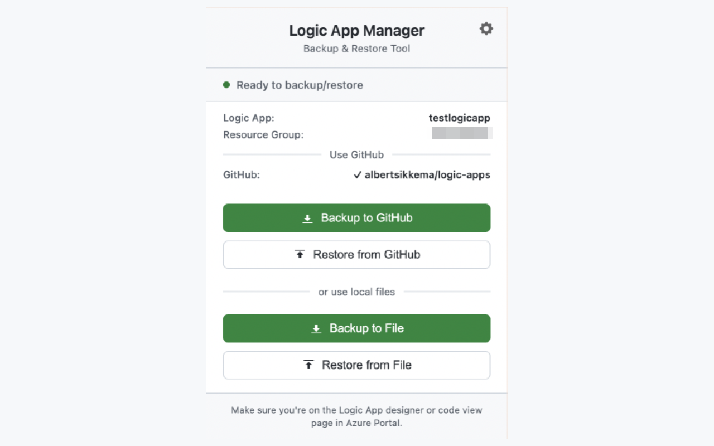

# Logic App Manager

A Chrome extension to backup and restore Azure Logic Apps directly from the Azure Portal using the Azure Management API.


## Features

### Core Functionality
- ✅ **Backup to File** - Save Logic Apps to JSON files with timestamped filenames
- ✅ **Restore from File** - Restore Logic Apps from JSON files
- ✅ **Backup to GitHub** - Push Logic App definitions directly to GitHub repositories
- ✅ **Restore from GitHub** - Browse commit history and restore from specific versions
- ✅ **Direct API Integration** - Uses Azure Management REST API and GitHub REST API
- ✅ **Auto-Authentication** - Extracts token from Azure Portal session
- ✅ **Dynamic Icon** - Blue icon on Azure Portal, gray icon elsewhere
- ✅ **Simple UI** - Clean, GitHub-inspired interface
- ✅ **No Data Collection** - All operations are local

### GitHub Integration (v1.1.0+)
- 📁 **Organized Storage** - Files saved as `apps/{workflowName}/{YYYY-MM-DD}-workflow.json`
- 📜 **Version History** - Browse and restore from commit history
- 🔒 **Secure Tokens** - GitHub Personal Access Tokens stored in `chrome.storage.session`
- 🔄 **Dual-Mode Operation** - GitHub and file-based options work independently

## Screenshot




## Installation

### Option 1: Install from Release (Recommended)

1. Go to the [Releases page](https://github.com/albertsikkema/logic-app-manager/releases)
2. Download the latest `logic-app-manager-v*.*.*.zip` file
3. Extract the ZIP file to a folder on your computer
4. Open Chrome and navigate to `chrome://extensions/`
5. Enable **Developer mode** (toggle in top-right corner)
6. Click **"Load unpacked"**
7. Select the extracted extension folder
8. The extension icon should appear in your toolbar

### Option 2: Install from Source

Clone this repository:
```bash
git clone https://github.com/albertsikkema/logic-app-manager.git
cd logic-app-manager
```

Then follow steps 4-8 from Option 1 above.

## GitHub Setup (Optional)

To enable GitHub integration for centralized backup and version control:

1. Click the extension icon and select **"Options"** (or right-click the icon → Options)
2. Enter your GitHub repository in the format: `owner/repo` (e.g., `myusername/logic-app-backups`)
3. Generate a GitHub Personal Access Token:
   - Go to [GitHub Settings → Developer settings → Personal access tokens → Tokens (classic)](https://github.com/settings/tokens)
   - Click **"Generate new token (classic)"**
   - Give it a name (e.g., "Logic App Manager")
   - Select the **`repo`** scope (required for private repositories)
   - Click **"Generate token"** and copy it
4. Paste the token in the extension options
5. Click **"Save Settings"**
6. The connection will be tested automatically

Once configured, you'll see **"Backup to GitHub"** and **"Restore from GitHub"** buttons in the popup.

**Note:** Tokens are stored in `chrome.storage.session` and cleared when you close your browser.

## Usage

### Backup a Logic App

#### Option A: Backup to GitHub (Requires setup)
1. Navigate to your Logic App in the [Azure Portal](https://portal.azure.com)
2. Make sure you're on the Logic App designer or code view page
3. Click the extension icon in your Chrome toolbar
4. Click **"Backup to GitHub"**
5. Enter a commit message (optional)
6. The workflow will be saved to: `apps/{workflowName}/{YYYY-MM-DD}-workflow.json`

#### Option B: Backup to File
1. Navigate to your Logic App in the [Azure Portal](https://portal.azure.com)
2. Make sure you're on the Logic App designer or code view page
3. Click the extension icon in your Chrome toolbar
4. Click **"Backup to File"**
5. Choose where to save the file
6. File will be saved as: `YYYYMMDD-HHmm-logicappname.json`

### Restore a Logic App

#### Option A: Restore from GitHub (Requires setup)
1. Navigate to the Logic App you want to restore
2. Click the extension icon
3. Click **"Restore from GitHub"**
4. Browse the commit history and select a version
5. Click **"Restore"** to confirm
6. The Logic App will be updated immediately
7. Refresh the Azure Portal page to see the changes

#### Option B: Restore from File
1. Navigate to the Logic App you want to restore
2. Click the extension icon
3. Click **"Restore from File"**
4. Select your backup JSON file
5. The Logic App will be updated immediately
6. Refresh the Azure Portal page to see the changes

## How It Works

### Azure Integration
1. **Metadata Extraction**: Reads Logic App details from the Azure Portal URL
2. **Authentication**: Extracts the Azure Management API token from browser sessionStorage (MSAL token)
3. **Backup**: Makes a GET request to `https://management.azure.com/.../workflows/{name}`
4. **Restore**: Makes a PUT request to update the Logic App definition

### GitHub Integration (Optional)
1. **Configuration**: Stores GitHub PAT and repository in `chrome.storage.session`
2. **Backup**: Creates/updates files at `apps/{workflowName}/{YYYY-MM-DD}-workflow.json` with commit messages
3. **Restore**: Fetches commit history, allows version selection, retrieves workflow JSON from specific commit
4. **Security**: All API calls made directly from browser, tokens never logged or transmitted elsewhere

## Requirements

- Chrome 88+ (Manifest V3 support)
- Active Azure Portal session
- Contributor or Owner permissions on the Logic App
- (Optional) GitHub account with Personal Access Token for GitHub integration

## API Endpoints Used

### Azure Management API
- **GET** (Backup): `/subscriptions/{sub}/resourceGroups/{rg}/providers/Microsoft.Logic/workflows/{name}?api-version=2016-10-01&$expand=connections.json,parameters.json`
- **PUT** (Restore): `/subscriptions/{sub}/resourceGroups/{rg}/providers/Microsoft.Logic/workflows/{name}?api-version=2016-10-01`

### GitHub REST API (v1.1.0+)
- **GET** `/repos/{owner}/{repo}` - Validate repository access
- **GET** `/repos/{owner}/{repo}/contents/{path}` - Get file SHA for updates
- **PUT** `/repos/{owner}/{repo}/contents/{path}` - Create/update workflow files
- **GET** `/repos/{owner}/{repo}/commits?path={path}` - List commit history
- **GET** `/repos/{owner}/{repo}/git/trees/{sha}` - Find files in specific commit

## Troubleshooting

### "Not on a Logic App page"
- Make sure you're on the Logic App editor/designer page
- The URL should contain `/workflows/YOUR-LOGIC-APP`
- Try refreshing the page

### "No auth token found"
- Refresh the Azure Portal page
- Make sure you're logged into Azure
- Check that you have the required permissions

### Backup/Restore fails with 401 Unauthorized
- Your session token has expired
- Refresh the Azure Portal page to get a new token

### GitHub options not showing
- Make sure you've configured GitHub in the Options page
- Check that your token has the `repo` scope
- Verify the repository format is `owner/repo`

### GitHub backup/restore fails
- Verify your GitHub token hasn't expired
- Check that you have write access to the repository
- Ensure the repository exists and is accessible
- Check your internet connection
- Look at browser console (F12) for detailed error messages

### "Failed to get file SHA" error
- This is normal for the first backup of a Logic App
- The extension creates the file automatically
- If it persists, check repository permissions

## Project Structure

```
logic-app-manager/
├── manifest.json              # Extension configuration
├── background.js              # Service worker for icon state management
├── popup.html                 # Extension popup UI
├── popup.js                   # UI logic, Azure & GitHub API calls
├── options.html               # GitHub configuration page
├── options.js                 # GitHub settings management
├── content.js                 # Metadata and token extraction
├── styles.css                 # GitHub-inspired styling
├── icons/                     # Extension icons
│   ├── icon.svg               # Active icon source (Azure blue)
│   ├── icon-inactive.svg      # Inactive icon source (grayscale)
│   ├── icon16.png             # 16x16 active icon
│   ├── icon48.png             # 48x48 active icon
│   ├── icon128.png            # 128x128 active icon
│   ├── icon16-inactive.png    # 16x16 inactive icon
│   ├── icon48-inactive.png    # 48x48 inactive icon
│   └── icon128-inactive.png   # 128x128 inactive icon
├── LICENSE                    # MIT License
├── PRIVACY_POLICY.md          # Privacy policy
├── README.md                  # This file
└── screenshot.png             # Extension screenshot
```

## Security & Privacy

- ✅ All operations are performed locally in your browser
- ✅ Uses your existing Azure Portal authentication
- ✅ GitHub tokens stored securely in `chrome.storage.session` (cleared on browser close)
- ✅ No data sent to external servers (except Azure/GitHub APIs when you use those features)
- ✅ Tokens are only used for authorized API calls
- ✅ No analytics or tracking
- ✅ Open source - audit the code yourself

📄 Read our full [Privacy Policy](PRIVACY_POLICY.md)

## Roadmap & PRO Version

### Current Version (Free & Open Source)
The current version provides core backup and restore functionality with GitHub integration for version control.

### PRO Version (Coming Soon) 💼

Advanced features for enterprise teams and professional workflows:

- 🚀 **Advanced Release Management** - Automated release pipelines and deployment workflows
- 🌍 **Multiple Environments** - Manage Dev, Test, Accept, and Production environments
- 🔍 **Enhanced Diff & Merge Views** - Visual comparison and intelligent merging of Logic Apps
- 👥 **Team Collaboration** - Multi-user workflows, approval processes, and role-based access
- 📊 **Advanced Analytics** - Deployment tracking, change history, and audit logs
- 🔄 **Automated Sync** - Scheduled backups and environment synchronization
- 📝 **Template Generation** - Export to ARM templates, Terraform, Bicep, and other IaC formats
- ⚡ **Azure Deployment Integration** - Direct deployment via Terraform, Azure CLI, PowerShell, and Azure DevOps
- 🔧 **Infrastructure as Code** - Full IaC workflow support with parameterization and environment variables
- 🏢 **Enterprise Support** - Priority support and custom integration options

**Interested in the PRO version?**
📧 Contact [Albert Sikkema](https://albertsikkema.com) for details, pricing, and licensing information.

## Contributing

Contributions to the open-source version are welcome! Please feel free to submit a Pull Request.

### Ideas for Contributions

**Open Source Features:**
- [ ] Support for Azure Logic Apps Standard (not just Consumption)
- [ ] Batch backup multiple Logic Apps
- [ ] Backup connections and parameters separately
- [ ] Branch selection for GitHub operations (currently uses default branch)
- [ ] Dark mode
- [ ] Search/filter commit history
- [ ] Backup tagging and notes
- [ ] Keyboard shortcuts
- [ ] Workflow validation before restore

**Note:** Advanced features like release management, multi-environment support, enhanced diff/merge views, team collaboration, template generation (ARM/Terraform/Bicep), and Azure deployment integrations will be available in the PRO version.

## Development

```bash
# Clone the repository
git clone https://github.com/albertsikkema/logic-app-manager.git
cd logic-app-manager

# Load in Chrome for development
# 1. Go to chrome://extensions/
# 2. Enable Developer mode
# 3. Click "Load unpacked"
# 4. Select this folder

# Make your changes and reload the extension
```

## License

MIT License - see [LICENSE](LICENSE) file for details

## Author

Created by [Albert Sikkema](https://albertsikkema.com)

## Acknowledgments

- Uses Azure Management REST API
- Inspired by the need for quick Logic App version control
- Built with vanilla JavaScript (no frameworks)

## Support

If you find this extension helpful, please ⭐ star this repository!

**Using it personally?** Have fun! 🎉

**Getting paid to use it professionally?** Please consider supporting me:

<a href="https://www.buymeacoffee.com/albertsikkema" target="_blank"></a>

For issues or questions:
1. Check the [Troubleshooting](#troubleshooting) section
2. Search [existing issues](https://github.com/albertsikkema/logic-app-manager/issues)
3. Create a [new issue](https://github.com/albertsikkema/logic-app-manager/issues/new) with details

---

## Legal Notice

**Disclaimer:** This extension is not officially affiliated with or endorsed by Microsoft or Azure.

**Limitation of Liability:** THE AUTHOR AND CONTRIBUTORS ARE NOT RESPONSIBLE FOR ANY DAMAGE, DATA LOSS, PRODUCTION OUTAGES, OR THE END OF THE WORLD CAUSED BY USING THIS EXTENSION. YOU USE THIS SOFTWARE ENTIRELY AT YOUR OWN RISK. By installing and using this extension, you accept full responsibility for all consequences.
